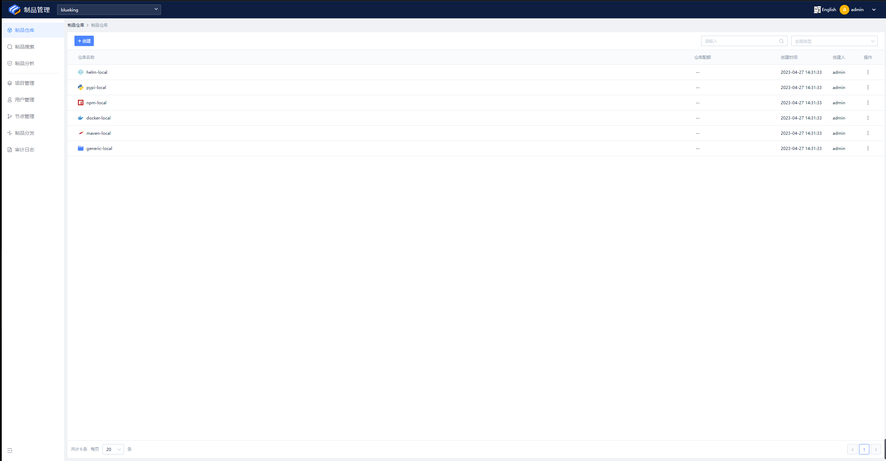
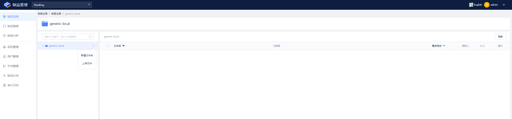
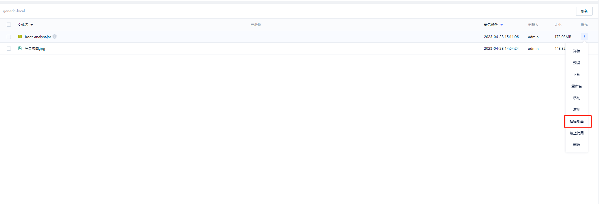

# 快速开始

## 安装前的准备

因为是使用容器化一键部署，所以你需要提前安装好docker软件。

## 开始安装

1. 配置host

默认域名为 bkrepo.example.com，配置好DNS或者hosts文件，使域名指向你的服务器ip。

2. 启动bk-repo

```sh
docker run -idt  -p 80:80 --name bkrepo  bkrepo/bkrepo
```

3. 查看日志

```sh
docker logs -f bkrepo
```

看到日志输出：Started BootApplicationKt in 80.354 seconds (JVM running for 81.53)，即表示启动成功。

3. 访问bk-repo

访问http://bkrepo.example.com，可以看到登录页面。初始账号为admin，密码为password。

<figure><figcaption><p>登录页面</p></figcaption></figure>

登录成功后，即可看到项目首页。系统已经默认创建了一个叫blueking的项目，并且还创建了6个仓库。

<figure><figcaption><p>首页</p></figcaption></figure>

## 开始使用

点击generic-local仓库，再点击旁边的三个点按钮，可以看到新建文件夹和上传文件两个按钮。

<figure><figcaption><p>generic-local</p></figcaption></figure>

现在我们上传一个文件，上传成功后可以看到以下页面。

<figure><figcaption><p>上传成功</p></figcaption></figure>

到这里，恭喜你！已经安装好了制品库，并且学会了使用generic仓库！

当然这里只是作为一个入门教学，后面会有更详细与高阶的使用说明。

## 指定域名运行

实际场景中，你希望可以使用自己的域名，这当然也是可以的。

添加相关环境变量：

* BK\_REPO\_HOST：bk-repo域名
* BK\_REPO\_DOCKER\_HOST：docker  registry 域名

```sh
docker run -idt  -p 80:80 --name bkrepo -e BK_REPO_HOST="bkrepo.com" -e BK_REPO_DOCKER_HOST="docker.bkrepo.com" bkrepo/bkrepo
```

## 开启制品扫描功能

如果你需要使用制品扫描功能则需要额外的参数进行开启。

* BK\_REPO\_ANALYST\_DISPATCHER\_DOCKER\_ENABLED="true"：开启制品分析服务
* \--add-host=bkrepo.example.com:127.0.0.1：添加host。让制品分析服务可以访问到你的制品库。
* \-v /var/run/docker.sock:/var/run/docker.sock：制品分析服务是通过使用容器运行扫描器，对制品进行扫描，所以这里需要让容器内也能访问宿主机的docker服务。

```sh
docker run -idt  -e BK_REPO_ANALYST_DISPATCHER_DOCKER_ENABLED="true" --add-host=bkrepo.example.com:127.0.0.1   -v /var/run/docker.sock:/var/run/docker.sock -p 80:80 --name bkrepo   bkrepo/bkrepo
```

添加参数启动后，点击文件的操作中，即可看到扫描制品按钮。

<figure><figcaption><p>制品扫描按钮</p></figcaption></figure>

## 持久化部署

实际场景中，你希望数据可以持久化，以免容器重启导致数据丢失。

通过以下步骤开启持久化：

1. 创建bkrepo-date数据卷

```sh
docker volume create --name bkrepo-data
```

2. 挂载数据卷

```sh
docker run -idt -p 80:80 --name bkrepo -v bkrepo-data:/bkrepo-data bkrepo/bkrepo
```

这样在下次重启容器时，数据便可以保留下来了。

## 建议

这个方案部署的服务，适用于中小型规模的制品库。如果规模较大的话，建议使用云原生或者二进制的部署方案。
